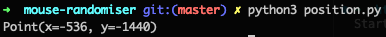
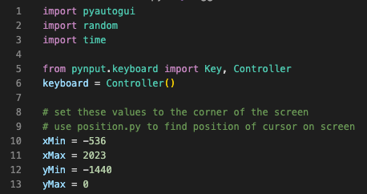
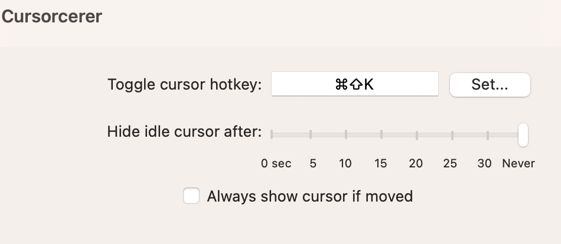

# mouse-randomiser
Opens a list of html files that render cool graphics in Google Chrome on loop.

> :warning: Mouse movement out of the box only supports macOS due to it supporting

## Setup
### Screen dimensions
You need to do this so the limits of where the mouse can move to are known.

1. Get the html graphics on the monitor you want them to be displayed
   - See [Browser open on wrong display](../html-looper/README.md#browser-open-on-wrong-display) in the `Troublehsooting` section of `README.md` for `html-looper`
2. Determine co-ordinates of min and max position in x and y axis of the screen
   1. In your terminal window, type `python3 position.py` but don't press `Enter` key
   2. Move your mouse to the top-left corner of the screen you want to run the cool graphics on
       - Don't click as you want the terminal window to be the focused window
   3. Press `Enter` key. This should print `Point(x=???, y=???)`
    
   4. The x and y values are the **minimum** x and y co-ordinates for that screen
   5. In your terminal window, type `python3 position.py` again and again don't press `Enter` key
   6. Move your mouse to the bottom-right corner of your desired screen
       - Again don't click as you want the terminal window to be the focused window
   7. Press `Enter` key. This should print the same with different numbers.
   8. The x and y values are the **maximum** x and y co-ordinates for that screen
3. Update values in script
   1. Open [mouse-randomiser/main.py](./main.py) in a text editor/IDE
   2. At the top of this file, set the x and y min/max values based on your commands above
    
   3. Save the file

### Cursor hiding
1. Download and Install [Cursorcerer](https://doomlaser.com/cursorcerer-hide-your-cursor-at-will/)
2. Go to Cursorcerer settings in `Settings` app
3. Set hotkey to `Cmd + Shift + K`, `Hide idle cursor after` to `Never` and untick `Always show if moved`

> :information_source: If you want to use a different hotkey, set it here and then you need to update the commands within the function `toggleCursor` inside [`mouse-randomiser/main.py`](./main.py)
>
> You can find acceptable values to substitute this with from [pynput docs](https://pynput.readthedocs.io/en/latest/keyboard.html)

## Usage
1. Open a new terminal window on top of the one used for `html-looper`
    - If you have multiple screens, it does not matter which one this is open on
2. Set current directory in your terminal window to be this directory, `mouse-randomiser`, not the repo root directory
3. Execute command `python3 main.py`
4. Follow the prompts in your terminal window
    - One of the prompts is to delay starting the mouse movement after starting the script. This is so that you can get `html-looper` running as once you have a full screen Chrome window running, you won't want to leave it to start the `mouse-randomiser`.